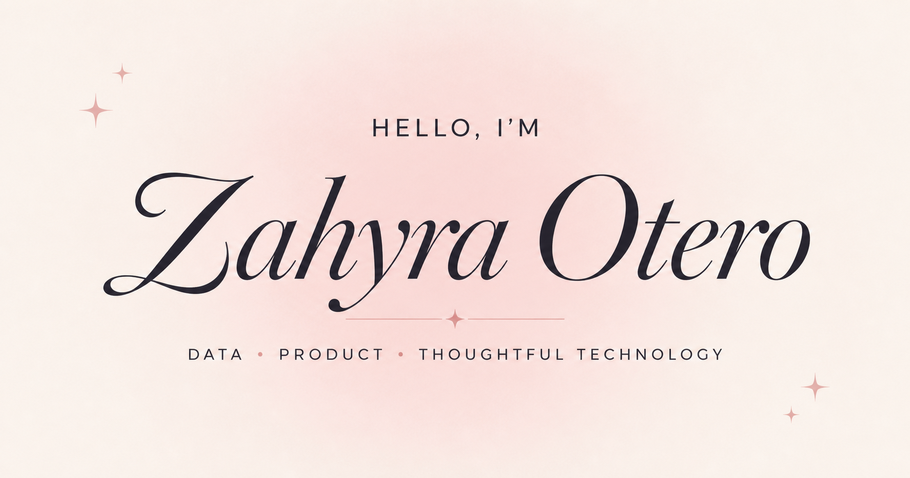

<div align="center">



# Zahyra Otero · Portfolio ✦

**Data · Product · Thoughtful Technology**

A personal portfolio centered on useful technology, intentional design, and the people behind every problem.

[View the portfolio](https://zahyra-portfolio.vercel.app) · [LinkedIn](https://www.linkedin.com/in/zahyra-otero/) · [GitHub](https://github.com/zlm228)

</div>

## A little about me

I am Zahyra, a first-generation Latina and Data Science student at New York University exploring the intersection of data, software, AI, and product. I enjoy turning everyday problems into technology that feels accessible, thoughtful, and genuinely enjoyable to use.

This portfolio brings together the products I have built, the technical skills I am developing, and the visual details that make my work feel like me. I am especially interested in consumer technology, beauty, entertainment, and fintech, along with the ways these industries can make products and services more accessible.

## Selected work

### 01 · [Be1Space](https://be1space.vercel.app/)

A full-stack study-space discovery platform that helps NYU students find, filter, and save affordable and accessible places to work across New York City.

`Next.js` `React` `FastAPI` `Supabase` `REST APIs`

### 02 · [HVAC Margin Rescue](https://the-hvac-margin-rescue-challenge.vercel.app/)

A full-stack datathon application that analyzes HVAC project data, identifies financially at-risk projects, and surfaces margin, billing, and operational risk indicators.

`Python` `FastAPI` `React` `REST APIs`

### 03 · Eclipse at JGM Innovation

An internal AI-powered workspace developed during my internship. My work included responsive frontend interfaces, prompt engineering and testing, chatbot features, and automated data workflows.

`JavaScript` `HTML/CSS` `Prompt engineering` `Google Apps Script` `Zapier`

## The portfolio

The site was designed to feel editorial, warm, and personal while remaining easy to navigate. It includes:

- A personal introduction grounded in my identity and interests
- Detailed project stories that highlight both frontend and backend work
- An expandable interface gallery for my Eclipse UI work
- A responsive layout, mobile navigation, and accessible focus states
- Direct links to live projects, my résumé, GitHub, LinkedIn, and email

## Built with

- Next.js 16 and React 19
- TypeScript
- Tailwind CSS and custom responsive CSS
- Next.js image and font optimization
- ESLint and accessibility-focused linting
- Vercel for continuous deployment

## Run it locally

```bash
git clone https://github.com/zlm228/zahyra-portfolio.git
cd zahyra-portfolio
npm install
npm run dev
```

Then open [http://localhost:3000](http://localhost:3000).

Before publishing changes, run:

```bash
npm run lint
npm run build
```

## Project structure

```text
zahyra-portfolio/
├── app/
│   ├── globals.css
│   ├── layout.tsx
│   └── page.tsx
├── public/
│   ├── projects/
│   ├── favicon.svg
│   ├── og.png
│   └── zahyra-otero-resume.pdf
└── README.md
```

<div align="center">

Designed with intention, curiosity, and a little sparkle ✦

</div>
